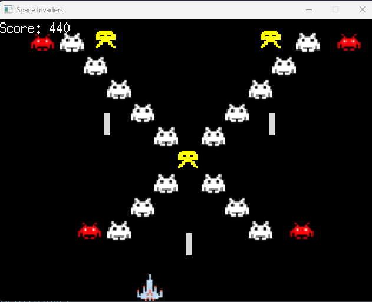

# Space Invaders

## Description

A space invaders game made with Ebiten, a simple 2D game library in Go.

## How to run the game

1. Install Go
2. Clone the repository
3. Run `go build -o space-invaders .`
4. Run `./space-invaders`

## Controls

- Move left: Left arrow key
- Move right: Right arrow key
- Shoot: Ctrl Key

## Screenshot

